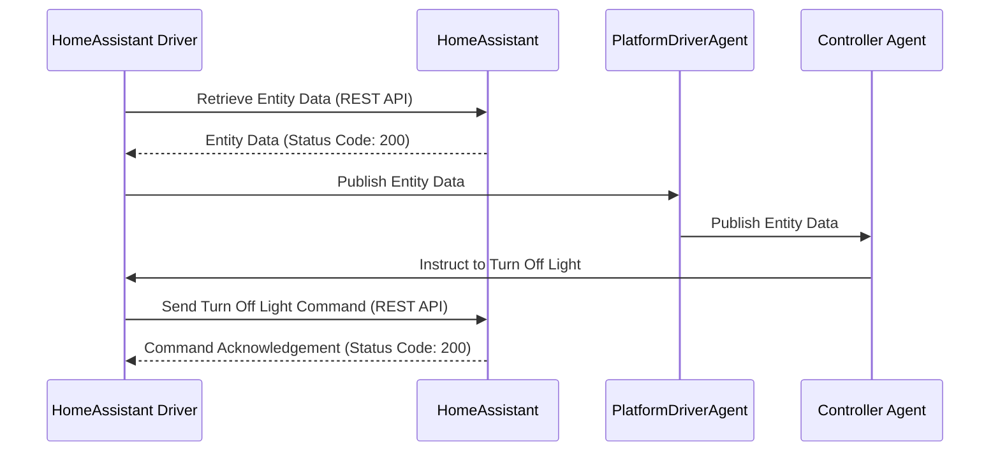

# volttron-lib-homeassistant-driver

The Home Assistant driver enables VOLTTRON to read any data point from any Home Assistant controlled device. Currently control (write access) is supported for lights, thermostats, input booleans, fans, covers, and media players.

The following diagram shows interaction between platform driver agent and home assistant driver.


```mermaid
sequenceDiagram
    HomeAssistant Driver->>HomeAssistant: Retrieve Entity Data (REST API)
    HomeAssistant-->>HomeAssistant Driver: Entity Data (Status Code: 200)
    HomeAssistant Driver->>PlatformDriverAgent: Publish Entity Data
    PlatformDriverAgent->>Controller Agent: Publish Entity Data
    Controller Agent->>HomeAssistant Driver: Instruct to Turn Off Light
    HomeAssistant Driver->>HomeAssistant: Send Turn Off Light Command (REST API)
    HomeAssistant-->>HomeAssistant Driver: Command Acknowledgement (Status Code: 200)
```

## Requirements

- Python >= 3.10
- VOLTTRON >= 10.0

## Installation

Before installing, VOLTTRON should be installed and running. Its virtual environment should be active.
Information on how to install of the VOLTTRON platform can be found [here](https://github.com/eclipse-volttron/volttron-core).

If not already installed, install the VOLTTRON platform driver:

```shell
vctl install volttron-platform-driver --vip-identity platform.driver --start
```

Install the Home Assistant driver library:

```shell
# Regular installation from PyPI (when available)
pip install volttron-lib-homeassistant-driver

# Development installation
cd /path/to/volttron-lib-homeassistant-driver
pip install -e .
```

The canonical `driver_type` is `home_assistant`.

## Configuration

Using the Home Assistant driver requires adding a device config and a registry config to the Platform Driver config store.

This repository already includes matching examples:

- `light.example.config`
- `light.example.json`

### Device Configuration

Use `light.example.config` with the following content:

```json
{
   "driver_config": {
       "url": "https://<HOME_ASSISTANT_HOST>:<PORT>",
       "access_token": "<LONG_LIVED_ACCESS_TOKEN>",
       "verify_ssl": true,
       "ssl_cert_path": "/path/to/fullchain.pem"
   },
   "driver_type": "home_assistant",
   "registry_config": "config://light.example.json",
   "interval": 30,
   "timezone": "UTC"
}
```

Configuration parameters:

| Parameter | Description |
|-----------|-------------|
| `url` | Full URL to your Home Assistant instance including protocol and port |
| `access_token` | Your long-lived Home Assistant access token |
| `verify_ssl` | Set to `true` to enable SSL certificate verification or `false` to bypass it |
| `ssl_cert_path` | Path to custom SSL certificate when `verify_ssl=true`. Set `null` if not using a custom cert. |

### Registry Configuration

Use `light.example.json` with your device information:

```json
[
   {
       "Entity ID": "sensor.example_temperature",
       "Entity Attribute": "state",
       "Volttron Point Name": "temperature_state",
       "Units": "C",
       "Units Details": "Celsius",
       "Writable": true,
       "Starting Value": true,
       "Type": "float",
       "Notes": "Example sensor point"
   }
]
```

### Add to Configuration Store

Add configuration files to the platform driver configuration store:

```bash
vctl config store platform.driver devices/home/bedroom light.example.config --json
vctl config store platform.driver light.example.json light.example.json --json
```

Restart the platform driver:

```bash
vctl restart 1
```

## Verify Data

Run the helper script to ensure the node is registered and points are readable:

```bash
./scripts/register_homeassistant_node.py --volttron-home /path/to/volttron_home
```

Expected output includes:

- `add_node: True` or `add_node: False` (False means node already exists)
- `scrape_all: {...}` with your point values
- `get_point(<point_name>): <value>`

## Registry Configuration Format

Each entry in the registry file should include:

- `Entity ID`: Full entity ID from Home Assistant (e.g., `light.kitchen`)
- `Entity Attribute`: Attribute to read/write (e.g., `state`, `brightness`)
- `Volttron Point Name`: Unique name in VOLTTRON for this point
- `Type`: Data type (`string`, `int`, `float`, `bool`)
- `Writable`: Whether point can be controlled (`true`/`false`)

> **Note:** Attributes can be found in the Developer Tools section of Home Assistant. Ensure `Volttron Point Name` is unique within each registry file.

## Supported Device Types

The driver supports reading from all Home Assistant entities and writing to:

| Device Type | Controllable Attributes |
|-------------|-------------------------|
| Lights | `state` (on/off), `brightness` (0-255) |
| Thermostats | `state` (0=Off, 2=Heat, 3=Cool, 4=Auto), `temperature` |
| Input Booleans | `state` (on/off) |
| Fans | `state` (on/off), `speed` |
| Covers | `state` (open/closed), `position` (0-100) |
| Media Players | `state` (on/off), `play_pause` |

## Advanced Features

### SSL Certificate Handling

For secure connections, the driver supports SSL certificate verification:

```json
"verify_ssl": true,
"ssl_cert_path": "/path/to/certificate.pem"
```

### URL Validation

The driver includes validation for proper URL formatting, helping identify common configuration issues such as:
- Malformed URLs with extra colons
- Missing port numbers
- Invalid IP address formats

## Running Tests

To run tests on the VOLTTRON home assistant driver:

1. Create a helper in your Home Assistant instance (Settings > Devices & services > Helpers > Create Helper > Toggle)
2. Name this toggle `volttrontest`
3. Run the tests:

```bash
cd volttron-lib-homeassistant-driver
python -m pytest tests
```

## Extending the Driver

To add support for additional device types:

1. Update the `_set_point` method to handle your new device type
2. Add domain-specific handler methods for controlling your devices
3. Ensure proper data type conversion between VOLTTRON and Home Assistant

## Disclaimer Notice

This material was prepared as an account of work sponsored by an agency of the United States Government. Neither the United States Government nor the United States Department of Energy, nor Battelle, nor any of their employees, nor any jurisdiction or organization that has cooperated in the development of these materials, makes any warranty, express or implied, or assumes any legal liability or responsibility for the accuracy, completeness, or usefulness or any information, apparatus, product, software, or process disclosed, or represents that its use would not infringe privately owned rights.
