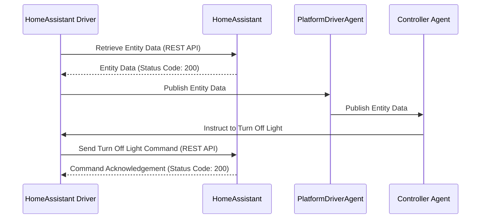

# volttron-lib-homeassistant-driver

The Home Assistant driver enables VOLTTRON to read any data point from any Home Assistant controlled device. Currently control (write access) is supported for lights, thermostats, input booleans, fans, covers, and media players.

The following diagram shows interaction between platform driver agent and home assistant driver.


```mermaid
sequenceDiagram
    HomeAssistant Driver->>HomeAssistant: Retrieve Entity Data (REST API)
    HomeAssistant-->>HomeAssistant Driver: Entity Data (Status Code: 200)
    HomeAssistant Driver->>PlatformDriverAgent: Publish Entity Data
    PlatformDriverAgent->>Controller Agent: Publish Entity Data
    Controller Agent->>HomeAssistant Driver: Instruct to Turn Off Light
    HomeAssistant Driver->>HomeAssistant: Send Turn Off Light Command (REST API)
    HomeAssistant-->>HomeAssistant Driver: Command Acknowledgement (Status Code: 200)
```

## Requirements

- Python >= 3.10
- VOLTTRON >= 10.0

## Installation

Before installing, VOLTTRON should be installed and running. Its virtual environment should be active.
Information on how to install of the VOLTTRON platform can be found [here](https://github.com/eclipse-volttron/volttron-core).

If not already installed, install the VOLTTRON platform driver:

```shell
pip install volttron-platform-driver
```

Install the Home Assistant driver library:

```shell
# Regular installation from PyPI (when available)
pip install volttron-lib-homeassistant-driver

# Development installation
pip install -e /path/to/volttron-lib-homeassistant-driver/
```

## Configuration

Using the Home Assistant driver requires adding device configuration and registry configuration files to the Platform Driver's configuration store.

Create a directory named `config` and use change directory to enter it.

```shell
mkdir config
cd config
```

### Device Configuration

Create a file named `homeassistant.config` with the following content:

```json
{
   "driver_config": {
       "url": "http://[Your Home Assistant IP]:[Your Port]",
       "access_token": "[Your Home Assistant Access Token]",
       "verify_ssl": true,
       "ssl_cert_path": null
   },
   "driver_type": "home_assistant",
   "registry_config": "config://homeassistant.json",
   "interval": 30,
   "timezone": "UTC"
}
```

Configuration parameters:

| Parameter | Description |
|-----------|-------------|
| `url` | Full URL to your Home Assistant instance including protocol and port |
| `access_token` | Your long-lived Home Assistant access token |
| `verify_ssl` | Set to `true` to enable SSL certificate verification or `false` to bypass it |
| `ssl_cert_path` | Path to custom SSL certificate (optional, leave as `null` if not using) |

### Registry Configuration

Create a file named `homeassistant.json` with your device information:

```json
[
   {
       "Entity ID": "light.example",
       "Entity Attribute": "state",
       "Volttron Point Name": "light_state",
       "Units": "On / Off",
       "Units Details": "on/off",
       "Writable": true,
       "Starting Value": true,
       "Type": "boolean",
       "Notes": "lights hallway"
   },
   {
       "Entity ID": "light.example",
       "Entity Attribute": "brightness",
       "Volttron Point Name": "light_brightness",
       "Units": "int",
       "Units Details": "light level",
       "Writable": true,
       "Starting Value": 0,
       "Type": "int",
       "Notes": "brightness control, 0 - 255"
   }
]
```

### Add to Configuration Store

Add configuration files to the platform driver configuration store:

```bash
vctl config store platform.driver devices/home/bedroom homeassistant.config
vctl config store platform.driver homeassistant.json homeassistant.json --raw
```

Restart the platform driver:

```bash
vctl restart platform.driver
```

## Registry Configuration Format

Each entry in the registry file should include:

- `Entity ID`: Full entity ID from Home Assistant (e.g., `light.kitchen`)
- `Entity Attribute`: Attribute to read/write (e.g., `state`, `brightness`)
- `Volttron Point Name`: Unique name in VOLTTRON for this point
- `Type`: Data type (`string`, `int`, `float`, `bool`)
- `Writable`: Whether point can be controlled (`true`/`false`)

> **Note:** Attributes can be found in the Developer Tools section of Home Assistant. Ensure `Volttron Point Name` is unique within each registry file.

## Supported Device Types

The driver supports reading from all Home Assistant entities and writing to:

| Device Type | Controllable Attributes |
|-------------|-------------------------|
| Lights | `state` (on/off), `brightness` (0-255) |
| Thermostats | `state` (0=Off, 2=Heat, 3=Cool, 4=Auto), `temperature` |
| Input Booleans | `state` (on/off) |
| Fans | `state` (on/off), `speed` |
| Covers | `state` (open/closed), `position` (0-100) |
| Media Players | `state` (on/off), `play_pause` |

## Advanced Features

### SSL Certificate Handling

For secure connections, the driver supports SSL certificate verification:

```json
"verify_ssl": true,
"ssl_cert_path": "/path/to/certificate.pem"
```

### URL Validation

The driver includes validation for proper URL formatting, helping identify common configuration issues such as:
- Malformed URLs with extra colons
- Missing port numbers
- Invalid IP address formats

## Running Tests

To run tests on the VOLTTRON home assistant driver:

1. Create a helper in your Home Assistant instance (Settings > Devices & services > Helpers > Create Helper > Toggle)
2. Name this toggle `volttrontest`
3. Run the tests:

```bash
cd volttron-lib-homeassistant-driver
python -m pytest tests
```

## Extending the Driver

To add support for additional device types:

1. Update the `_set_point` method to handle your new device type
2. Add domain-specific handler methods for controlling your devices
3. Ensure proper data type conversion between VOLTTRON and Home Assistant

## Disclaimer Notice

This material was prepared as an account of work sponsored by an agency of the United States Government. Neither the United States Government nor the United States Department of Energy, nor Battelle, nor any of their employees, nor any jurisdiction or organization that has cooperated in the development of these materials, makes any warranty, express or implied, or assumes any legal liability or responsibility for the accuracy, completeness, or usefulness or any information, apparatus, product, software, or process disclosed, or represents that its use would not infringe privately owned rights.
