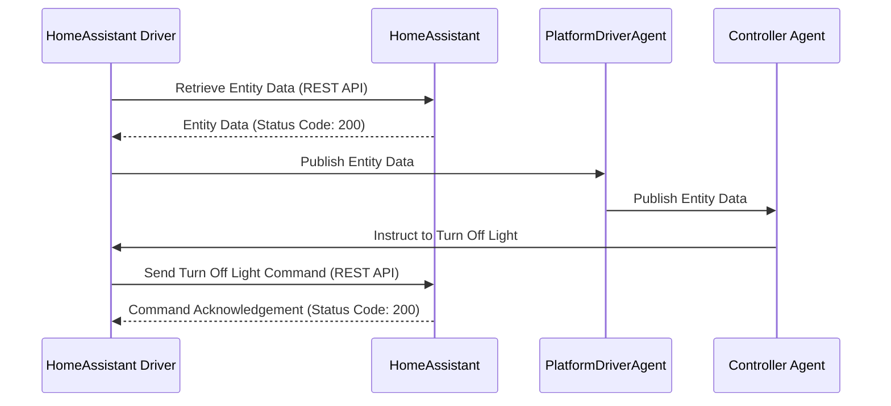

# volttron-lib-homeassistant-driver

The Home Assistant driver enables VOLTTRON to read any data point from any Home Assistant controlled device.
Currently control (write access) is supported only for lights (state and brightness) and thermostats (state and temperature).

The following diagram shows interaction between platform driver agent and home assistant driver.



## Requires

* python >= 3.10
* volttron >= 10.0

## Installation

Before installing, VOLTTRON should be installed and running.  Its virtual environment should be active.
Information on how to install of the VOLTTRON platform can be found
[here](https://github.com/eclipse-volttron/volttron-core).

Install the volttron platform driver:

```shell
vctl install volttron-platform-driver --vip-identity platform.driver --start
```

Install the volttron home assistant library.

```shell
pip install volttron-lib-home-assistant-driver
```

Using the Home Assistant driver requires adding copies of the device configuration and registry configuration files to the Platform Driver’s configuration store.

Create a directory named `config` and use change directory to enter it.

```shell
mkdir config
cd config
```

Create a file named `light.example.config` and input the below JSON. 

* `url`: Replace `[Your Home Assistant IP]` and `[Your Port]` with your Home Assistant's IP address and port number, respectively, removing the brackets []. Ensure you specify the protocol (`http` or `https`) based on your setup. Refer to the [Home Assistant documentation](https://developers.home-assistant.io/docs/auth_api/#long-lived-access-token). for finding your IP address.
* `access_token`: Substitute `[Your Home Assistant Access Token]` with your actual access token, again removing the brackets []. For instructions on obtaining your access token, visit [this guide](https://www.raycast.com/tonka3000/homeassistant).
* `verify_ssl`: Set to true to enable SSL certificate verification or false to bypass it. Default is true. Disabling verification may pose security risks.
* `ssl_cert_path`: Enter the path to your SSL certificate if you are using a custom certificate for verification. Leave this field empty if you are not using a custom certificate. This field is empty by default.

```json
{
   "driver_config": {
       "url": "http://[Your Home Assistant IP]:[Your Port]",
       "access_token": "[Your Home Assistant Access Token]",
       "verify_ssl": true,
       "ssl_cert_path": ""
   },
   "driver_type": "home_assistant",
   "registry_config": "config://light.example.json",
   "interval": 30,
   "timezone": "UTC"
}
```

>**Note:**
Ensure your `registry_config` parameter in your device configuration file, links to the correct registry config name in the config store. For more details on how volttron platform driver agent works with volttron configuration store see, [Platform driver configuration](https://volttron.readthedocs.io/en/main/agent-framework/driver-framework/platform-driver/platform-driver.html#configuration-and-installation). Examples for lights and thermostats are provided below.
Device configuration file contains the connection details to your home assistant instance and `driver_type` as "home_assistant". this file can be named anything you want but in this example we are naming it `light.example.config`

Create a file named `light.example.json` and enter your information. (*like the config, this file can be named anything and is only named light.example.json for demonstrative purposes*).

```json
[
   {
       "Entity ID": "light.example",
       "Entity Point": "state",
       "Volttron Point Name": "light_state",
       "Units": "On / Off",
       "Units Details": "on/off",
       "Writable": true,
       "Starting Value": true,
       "Type": "boolean",
       "Notes": "lights hallway"
   },
   {
       "Entity ID": "light.example",
       "Entity Point": "brightness",
       "Volttron Point Name": "light_brightness",
       "Units": "int",
       "Units Details": "light level",
       "Writable": true,
       "Starting Value": 0,
       "Type": "int",
       "Notes": "brightness control, 0 - 255"
   }
]
```

Add light.example.config and light.example.json to the configuration store.

```bash
vctl config store platform.driver devices/home/bedroom light.example.config
vctl config store platform.driver light.example.json light.example.json
```

View the status of the installed agent

```shell
vctl status
```

Registry files can contain one single device and its attributes or a logical group of devices and its attributes. Each entry should include the full entity id of the device, including but not limited to home assistant provided prefix such as "light.",  "climate." etc. The driver uses these prefixes to convert states into integers. Like mentioned before, the driver can only control lights and thermostats but can get data from all devices controlled by home assistant.

Each entry in a registry file should also have a 'Entity Point' and a unique value for 'Volttron Point Name'. The 'Entity ID' maps to the device instance, the 'Entity Point' extracts the attribute or state, and 'Volttron Point Name' determines the name of that point as it appears in VOLTTRON.

>**Note:**
Attributes can be located in the developer tools in the Home Assistant GUI.

When using a single registry file to represent a logical group of multiple physical entities, make sure the "Volttron Point Name" is unique within a single registry file. For example, if a registry file contains entities with id  'light.instance1' and 'light.instance2' the entry for the attribute brightness for these two light instances could have "Volttron Point Name" as 'light1/brightness' and 'light2/brightness' respectively. This would ensure that data is posted to unique topic names and brightness data from light1 is not overwritten by light2 or vice-versa.

## Example Thermostat Registry

For thermostats, the state is converted into numbers as follows: "0: Off, 2: heat, 3: Cool, 4: Auto",

```json
[
   {
       "Entity ID": "climate.my_thermostat",
       "Entity Point": "state",
       "Volttron Point Name": "thermostat_state",
       "Units": "Enumeration",
       "Units Details": "0: Off, 2: heat, 3: Cool, 4: Auto",
       "Writable": true,
       "Starting Value": 1,
       "Type": "int",
       "Notes": "Mode of the thermostat"
   },
   {
       "Entity ID": "climate.my_thermostat",
       "Entity Point": "current_temperature",
       "Volttron Point Name": "volttron_current_temperature",
       "Units": "F",
       "Units Details": "Current Ambient Temperature",
       "Writable": true,
       "Starting Value": 72,
       "Type": "float",
       "Notes": "Current temperature reading"
   },
   {
       "Entity ID": "climate.my_thermostat",
       "Entity Point": "temperature",
       "Volttron Point Name": "set_temperature",
       "Units": "F",
       "Units Details": "Desired Temperature",
       "Writable": true,
       "Starting Value": 75,
       "Type": "float",
       "Notes": "Target Temp"
   }
]
```

## Adding Features

The VOLTTRON home assistant driver utilizes the [home assistant rest api](https://developers.home-assistant.io/docs/api/rest/) to pull states and attributes as well as control states and attributes. Currently, the VOLTTRON Home Assistant driver supports pulling all states and attributes from Home Assistant but only allows control of thermostats (state and temperature) and lights (state and brightness).

To add control for new devices, first understand the desired functionality and how VOLTTRON will interpret it. For instance, agents like ILC require a numeric value, so a string value such as "on" for a light must be converted into an integer. Below, see the driver's code converting the state of lights to 1 or 0. We assume that lights always start with `light.`. When adding a new device, replace that with the device group's start. For instance, instead of `light.`, use `switch.`.

```python
elif "light." in entity_id:
    if entity_point == "state":
        state = entity_data.get("state", None)
        # Converting light states to numbers.
        if state == "on":
            register.value = 1
            result[register.point_name] = 1
        elif state == "off":
            register.value = 0
            result[register.point_name] = 0
```

To add a new device such as a smart switch, we would likely have to do a similar thing. You can simply add a new elif statement in the _scrape_all function to retrieve data for this new device and convert the values (if needed).

To actually control these devices with VOLTTRON, we need to update the _set_point function. Below you will see where the driver takes these new numbers and takes action based on the new register value.

```python
if "light." in register.entity_id:
if entity_point == "state":
    if isinstance(register.value, int) and register.value in [0, 1]:
        if register.value == 1:
            self.turn_on_lights(register.entity_id)
        elif register.value == 0:
            self.turn_off_lights(register.entity_id)
```

Once we get this new value such as 0, we call the appropriate function to turn off the light in Home Assistant. You may use the existing control functions as reference but keep in mind that the Home Assistant REST API requires different URLs for different devices so please keep the documentation close when adding new control functions.

## Running Tests

To run tests on the VOLTTRON home assistant driver you need to create a helper in your home assistant instance. This can be done by going to **Settings > Devices & services > Helpers > Create Helper > Toggle**. Name this new toggle **volttrontest**. After that navigate to the repo and run the test.

```bash
cd volttron-lib-home-assistant-driver
poetry install
poetry run pytest tests/test_home_assistant.py
```

If everything works, you will see 6 passed tests.

## Disclaimer Notice

This material was prepared as an account of work sponsored by an agency of the
United States Government.  Neither the United States Government nor the United
States Department of Energy, nor Battelle, nor any of their employees, nor any
jurisdiction or organization that has cooperated in the development of these
materials, makes any warranty, express or implied, or assumes any legal
liability or responsibility for the accuracy, completeness, or usefulness or any
information, apparatus, product, software, or process disclosed, or represents
that its use would not infringe privately owned rights.

Reference herein to any specific commercial product, process, or service by
trade name, trademark, manufacturer, or otherwise does not necessarily
constitute or imply its endorsement, recommendation, or favoring by the United
States Government or any agency thereof, or Battelle Memorial Institute. The
views and opinions of authors expressed herein do not necessarily state or
reflect those of the United States Government or any agency thereof.
